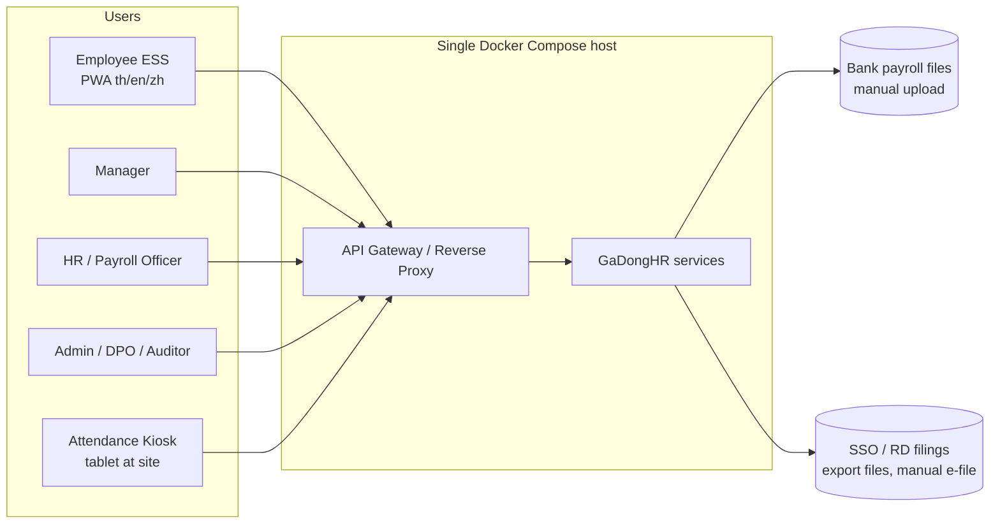
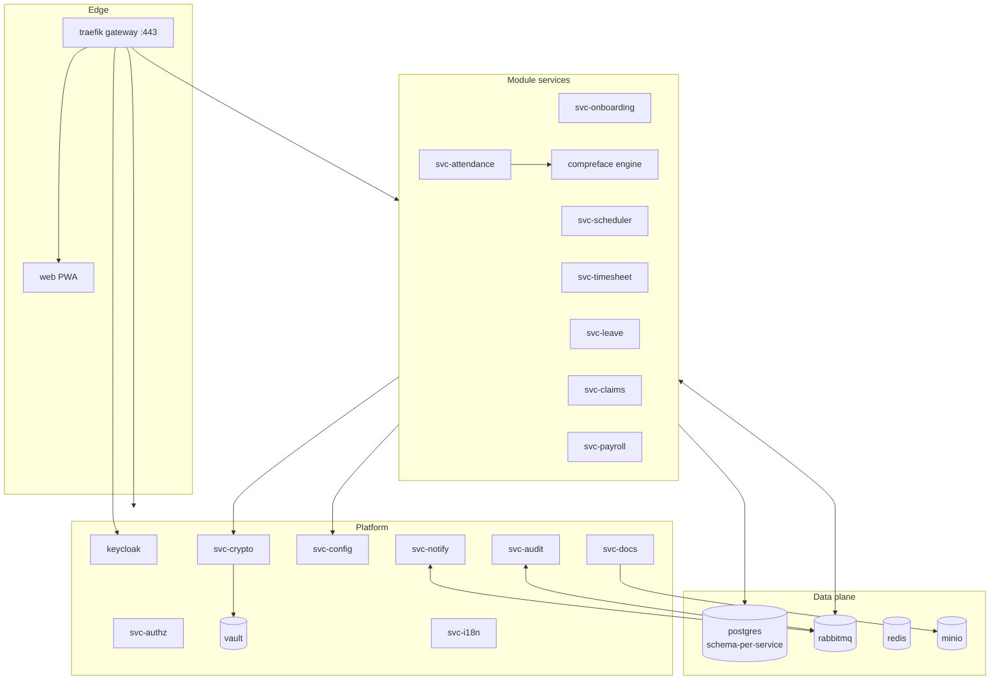
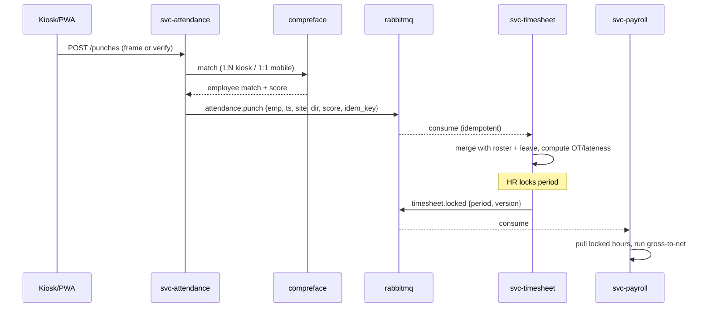

# GaDongHR — Architecture Overview

| Field | Value |
|---|---|
| Version | 0.1 (Draft) |
| Date | 2026-08-02 |
| Status | Stage 2 deliverable |
| Related | `SECURITY-ENCRYPTION-DESIGN.md`, `DATABASE-DESIGN.md`, `adr/`, `../../deploy/` |

## 1. Architecture Principles

1. **Microservices, one service per business module** (PRD M1–M7) plus platform services. Services own their data; no cross-service table access.
2. **Docker Compose is the whole deployment** — every component (services, DB, broker, face engine, key manager, gateway, storage) is a container on one host. No Kubernetes, no mandatory cloud dependency (ADR-001).
3. **Encrypt before write** — sensitive fields never reach the database in plaintext (see Security doc; ADR-004).
4. **Deny-by-default RBAC** at the gateway and inside every service.
5. **Events for facts, APIs for questions** — state changes publish domain events on the broker; synchronous REST only for queries/commands via the gateway.
6. **Statutory rules are data** — versioned, effective-dated config served by the Config service (Statutory Spec §1).
7. **Trilingual by construction** — all user-visible strings via i18n keys; documents rendered per-language server-side.

## 2. System Context

No personal data leaves the host in v1: bank/SSO/PND outputs are **files** the payroll officer uploads manually (PRD Non-Goal 5).

## 3. Service Catalog

### 3.1 Module services (one per PRD module)

| Service | Container | Owns | Publishes (events) | Consumes |
|---|---|---|---|---|
| `svc-onboarding` (M1) | `onboarding` | Employee master, contracts, documents metadata, consents, probation | `employee.created/updated/terminated`, `consent.granted/withdrawn` | — |
| `svc-scheduler` (M2) | `scheduler` | Shifts, rosters, holiday calendar, OT pre-approvals | `roster.published`, `ot.approved` | `employee.*`, `leave.approved` |
| `svc-timesheet` (M3) | `timesheet` | Daily time records, exceptions, period locks | `timesheet.locked`, `timesheet.corrected` | `attendance.punch`, `roster.published`, `leave.approved`, `ot.approved` |
| `svc-attendance` (M4) | `attendance` + `compreface` | Enrolment status, devices, punch events; delegates matching to face engine | `attendance.punch`, `attendance.liveness_failed` | `consent.granted/withdrawn`, `employee.terminated` |
| `svc-leave` (M5) | `leave` | Leave types, balances, accruals, requests | `leave.approved/cancelled`, `leave.balance_payout` | `employee.*`, statutory rules |
| `svc-claims` (M6) | `claims` | Claim types, submissions, approvals, reimbursement status | `claim.approved_for_payroll`, `claim.paid_offcycle` | `employee.*` |
| `svc-payroll` (M7) | `payroll` | Pay structures, runs, payslips, statutory exports, termination pay | `payroll.committed`, `payslip.issued` | `timesheet.locked`, `leave.balance_payout`, `claim.approved_for_payroll`, statutory rules |

### 3.2 Platform services

| Service | Container | Responsibility |
|---|---|---|
| Gateway | `traefik` | TLS termination, routing, rate limiting; forwards JWT to services |
| Identity & RBAC | `keycloak` + `svc-authz` | OIDC login (users), device auth (kiosks); `svc-authz` holds the permission model, role templates, org-scoping rules (Security doc §4) |
| Crypto/KMS | `vault` + `svc-crypto` | Vault Transit = key manager; `svc-crypto` = thin API used by services for envelope encrypt/decrypt + blind-index HMAC (ADR-004) |
| Config & Statutory Rules | `svc-config` | Effective-dated statutory rule store + amendment governance workflow (Statutory Spec §11); tenant settings; feature flags |
| i18n | `svc-i18n` | Translation bundles (th/en/zh), fallback logic, glossary; serves bundles to frontends and document renderer |
| Notification | `svc-notify` | In-app + email notifications, templated per language; LINE adapter is P2 |
| Document & Report | `svc-docs` | PDF generation (contracts, payslips, letters) with Thai/CJK font embedding, B.E. date rendering; stores files in MinIO (encrypted) |
| Audit | `svc-audit` | Append-only, hash-chained audit log consumed from broker + direct API; auditor read UI |
| Frontend | `web` | Single PWA (ESS + manager + admin consoles, role-driven), kiosk mode route |
| Data stores | `postgres`, `rabbitmq`, `redis`, `minio` | See §5 and DATABASE-DESIGN.md |
| Observability (optional profile) | `prometheus`, `grafana`, `loki` | Metrics, dashboards, logs |

## 4. Container Diagram

## 5. Communication Patterns

| Interaction | Pattern | Notes |
|---|---|---|
| Frontend → services | REST/JSON via gateway, OIDC JWT | OpenAPI per service (Stage 3 API manuals) |
| Kiosk → attendance | REST + local queue | Kiosk buffers punches ≥24 h offline; idempotency key = `device_id + seq` (PRD M4-4/M4-6) |
| Service → service (facts) | RabbitMQ topic exchange `gadong.events`, routing key = event name | At-least-once + consumer idempotency (processed-event table) |
| Service → service (queries) | REST via internal network only when unavoidable | Prefer event-carried state (local read models) |
| Services → crypto | REST to `svc-crypto` (mTLS internal) | Never call Vault directly |
| Services → config | REST + cached with `rules.updated` invalidation event | Effective-date resolution done by `svc-config` |

**Core event flow (attendance → payroll):**

## 6. Technology Stack (decisions in `adr/`)

| Layer | Choice | ADR |
|---|---|---|
| Deployment | Docker Compose, single host, profiles (`core`, `observability`) | ADR-001 |
| Module/platform services | Node.js 22 + TypeScript (NestJS) | ADR-002 |
| Database | PostgreSQL 16, one instance, **schema-per-service**, split-ready | ADR-003 |
| Broker | RabbitMQ 3.13 (quorum queues) | ADR-005 |
| Encryption/keys | Vault (Transit engine) + `svc-crypto`, envelope encryption, HMAC blind indexes | ADR-004 |
| Identity | Keycloak 26 (OIDC) + custom `svc-authz` for fine-grained RBAC | ADR-006 |
| Face engine | CompreFace (InsightFace models) self-hosted; PWA liveness challenge | ADR-007 |
| Files | MinIO (S3 API), server-side + client-side encryption for sensitive docs | ADR-003 |
| Frontend | React + Vite PWA, react-i18next, kiosk mode | ADR-008 |
| PDF | `svc-docs` using Playwright/HTML→PDF with embedded Sarabun (Thai) + Noto Sans SC fonts | ADR-008 |

## 7. Deployment Topology

- **Single `docker-compose.yml`** + `docker-compose.override.{dev,prod}.yml`; secrets via `.env` (never committed — `.env.example` provided) and Docker secrets for prod.
- Internal network `gadong-internal` (services, DB, broker, Vault — not published); only `traefik` publishes 443/80.
- Healthchecks on every container; `depends_on: condition: service_healthy` ordering; restart policies `unless-stopped`.
- Volumes: `pg_data`, `vault_data`, `minio_data`, `rabbitmq_data`, `kiosk-spool` (on kiosk device). Backup = scripted `pg_dump` + MinIO mirror + Vault snapshot (Stage 5 runbook).
- Sizing target (PRD §7.5): 1,000 employees / 200 concurrent on 8 vCPU / 16 GB / 200 GB SSD; CompreFace runs CPU-only by default.

## 8. Scalability & Failure Notes

- Stateless services scale by `docker compose up --scale svc-x=2` behind Traefik if ever needed; DB/broker are the single-host limits — acceptable for the 1,000-employee target.
- Broker outage: producers use outbox tables (transactional outbox) so events are never lost; consumers are idempotent.
- Vault sealed/unavailable: services fail **closed** for sensitive-field operations; non-sensitive reads continue; alert raised.
- Face engine down: kiosks fall back to PIN/QR method automatically (PRD M4-5); punches remain method-agnostic downstream.
