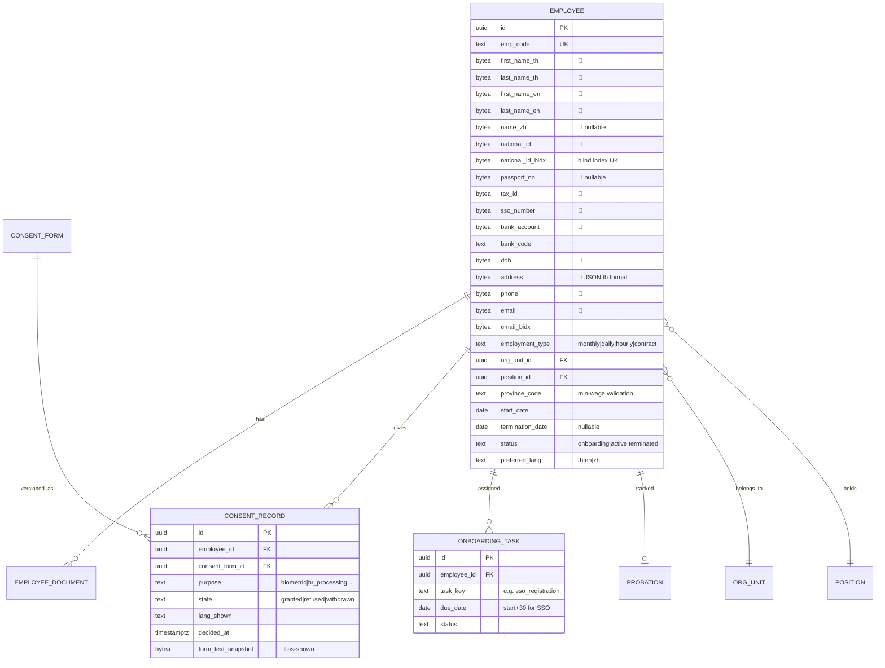
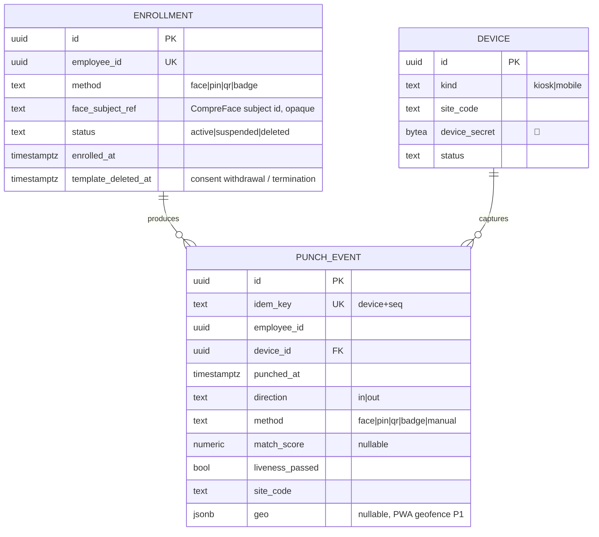
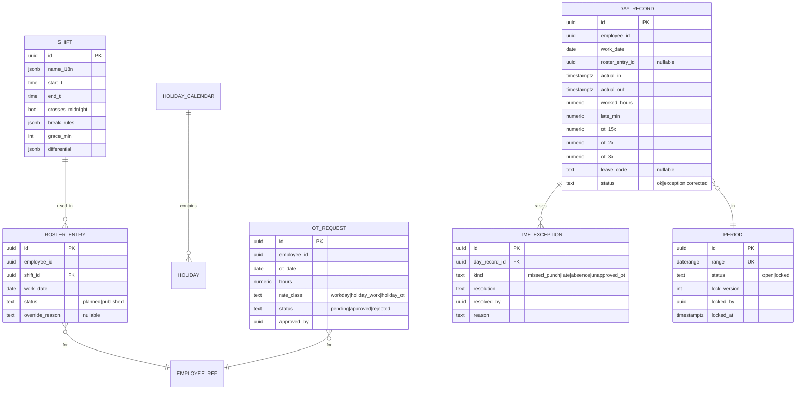
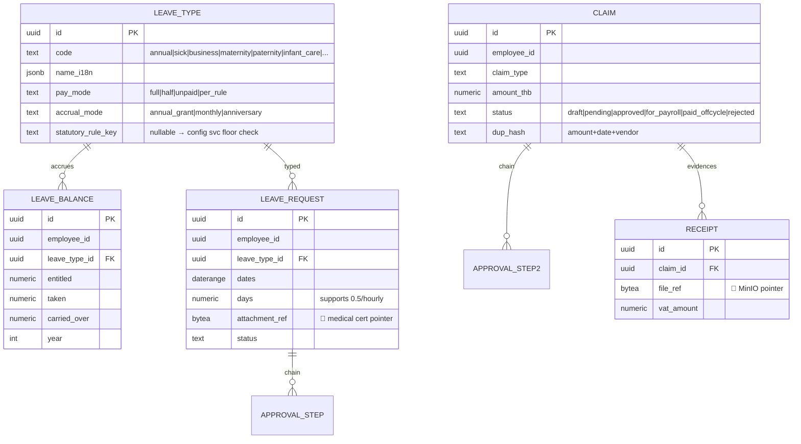
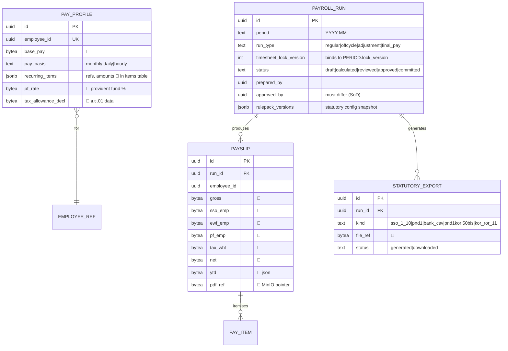
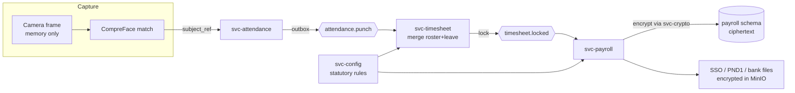
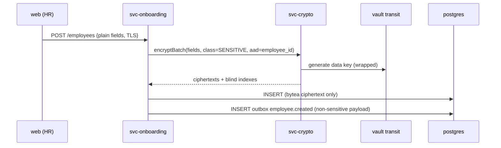

# GaDongHR — Database Design (ERD & Data Flows)

| Field | Value |
|---|---|
| Version | 0.1 (Draft) |
| Date | 2026-08-02 |
| Status | Stage 2 deliverable |
| DBMS | PostgreSQL 16 — one instance, schema-per-service (ADR-003) |

## 1. Conventions

- Schemas: `onboarding`, `scheduler`, `timesheet`, `attendance`, `leave`, `claims`, `payroll`, `authz`, `config`, `audit`, `notify`, `docs`. Each service's DB role can access **only its own schema** (enforced via GRANTs) — cross-service data travels by events/APIs only.
- `id` = UUIDv7 PK; `created_at/updated_at timestamptz`; soft delete only where retention requires (`deleted_at`), otherwise hard delete per PDPA schedule.
- **Encrypted columns** are marked 🔐 — stored as `bytea` ciphertext (envelope-encrypted by `svc-crypto` before INSERT/UPDATE; see Security doc §3). Searchable encrypted fields get a companion `*_bidx` (blind index, HMAC-SHA256, `bytea`) — plaintext never indexed.
- Every schema has `processed_events(event_id PK, processed_at)` for consumer idempotency and `outbox(id, topic, payload, created_at, published_at)` for transactional event publishing.
- Employee identity across services: `employee_id` (UUID) replicated via `employee.*` events into local read models (`*_employee_ref` tables) — no foreign keys across schemas.

## 2. Core ERDs (key tables per schema)

### 2.1 `onboarding` (M1 — system of record for people)

`ORG_UNIT(id, parent_id, name_i18n jsonb, cost_center)` forms the tree used by RBAC data-scoping (`authz` caches it).

### 2.2 `attendance` (M4) — biometric isolation

**Face templates live only inside the CompreFace container's own Postgres schema** (its embeddings), keyed by an opaque `face_subject_ref`; GaDongHR schemas never store embeddings. CompreFace's storage volume is encrypted at rest, and deletion of a subject on consent withdrawal is verified by `svc-attendance` (PDPA doc §4.4). Raw images are never persisted by `svc-attendance` (PDPA doc §5).

### 2.3 `scheduler` (M2), `timesheet` (M3)

### 2.4 `leave` (M5), `claims` (M6)

`APPROVAL_STEP(id, subject_id, level, approver_role, approver_id, decided_at, decision, comment)` is a shared pattern (per-schema copy).

### 2.5 `payroll` (M7)

Committed runs are immutable (DB trigger blocks UPDATE/DELETE on `status='committed'`; corrections are new `adjustment` runs).

### 2.6 `config` (statutory rules), `authz`, `audit`

- `config.statutory_rule(id, rule_key, value jsonb, unit, statutory_floor jsonb, ceiling jsonb, citation, effective_from, effective_to, governance_class, status, proposed_by, approved_by, reason)` — exactly the Statutory Spec §1 model; unique on `(rule_key, effective_from)`.
- `authz.role(id, code, name_i18n)`, `authz.permission(code)`, `authz.role_permission`, `authz.user_role(user_id, role_id, org_scope_unit_id)` — org-scoped role grants (Security doc §4).
- `audit.entry(id bigserial, occurred_at, actor_id, actor_role, action, entity, entity_id, before_hash, after_hash, purpose, prev_entry_hash, entry_hash)` — hash-chained, append-only (INSERT-only role; no UPDATE/DELETE grants).

## 3. Data Flow Diagrams

### 3.1 Punch → Timesheet → Payroll (with encryption boundaries)

### 3.2 Onboarding write path (encrypt-before-write)

Events **never carry sensitive plaintext** — consumers needing a sensitive field fetch it by ID through the owning service's API (authorised + audited).

## 4. Retention Enforcement

Nightly `retention-job` (container) queries each schema's retention view (driven by PDPA doc §7 schedule in `config`), moves candidates to a DPO review queue, then performs **crypto-erasure** (destroy per-record data key via `svc-crypto`) followed by physical DELETE. Legal-hold flags on employee/payroll rows block deletion and surface the blocking statute + date.

## 5. Migration & Versioning

- Per-service migrations (`node-pg-migrate`), run by an init container per service on startup; schema version table per schema.
- Seed packs: statutory rules (Statutory Spec), Thai holidays, provinces + minimum wage, banks, role templates, i18n bundles — loaded by `svc-config` seeder, idempotent.
