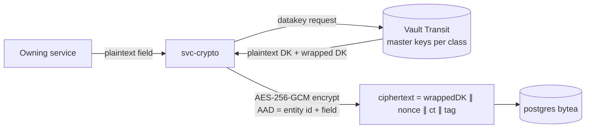

# GaDongHR — Security Architecture, Encryption & RBAC Design

| Field | Value |
|---|---|
| Version | 0.1 (Draft) |
| Date | 2026-08-02 |
| Status | Stage 2 deliverable |
| Drivers | PRD §7.1, PDPA doc §5, Statutory Spec §11 (SoD) |

## 1. Security Objectives

1. A raw database dump, stolen backup, or compromised DB credential reveals **no readable sensitive data** (encrypt-before-write).
2. Every API call is authenticated, authorised against an explicit permission, and data-scoped (deny-by-default RBAC).
3. Biometric templates are readable by **no human role** and usable by exactly one service.
4. Payroll and statutory-config changes enforce **segregation of duties**.
5. All privileged and sensitive-data access is captured in a tamper-evident audit trail.

## 2. Data Classification

| Class | Examples | Storage treatment |
|---|---|---|
| S3 — Sensitive (PDPA s.26 + critical) | Face template refs, national ID, health attachments, bank account, salary/pay amounts, tax declarations | Field-level envelope encryption 🔐 + blind index if searchable; access audited per read |
| S2 — Confidential | Names, contacts, addresses, DOB, punch geo | Field-level encryption 🔐; normal RBAC |
| S1 — Internal | Rosters, shift defs, leave types, org units | TLS + at-rest volume encryption only |
| S0 — Public/config | i18n bundles, holiday names | No special treatment |

## 3. Encryption Design (encrypt-before-write)

### 3.1 Envelope encryption via Vault Transit



- **Master keys** (KEKs): one per data class per service (e.g., `kek-onboarding-s3`), created and held in Vault Transit — never leave Vault.
- **Data keys** (DEKs): generated per record (or per entity), used with AES-256-GCM, stored only in wrapped form inside the ciphertext blob. Decrypt = unwrap via Vault, then local AES-GCM.
- **AAD binding**: `entity_id + field_name` as GCM associated data prevents ciphertext swapping between rows/fields (e.g., face template ref bound to employee).
- **Key rotation**: Vault key versions; new writes use the latest KEK version; background re-wrap job re-encrypts wrapped DEKs (no bulk data re-encryption needed). Full DEK re-encryption available as maintenance command.
- **Crypto-erasure**: destroying a record's DEK (dropping the wrapped key by rewriting the blob header to a tombstone) renders data irrecoverable → used by the PDPA retention job.

### 3.2 Searchable encryption — blind indexes

Exact-match lookup fields (national ID, email) get `field_bidx = HMAC-SHA256(k_bidx_class, normalise(plaintext))` computed in `svc-crypto` with a dedicated HMAC key per field class. Uniqueness and lookups use the bidx column; no partial/LIKE search on S3 fields (product accepts this limitation; UI searches by employee code/name read-model instead).

### 3.3 Vault lifecycle in Docker Compose

- Vault runs with integrated storage (raft) on volume `vault_data`; **auto-unseal is not assumed** — documented unseal ceremony (3-of-5 Shamir shares, held by customer officers) in the Stage 5 runbook; optional transit-auto-unseal via a second lightweight Vault for convenience deployments.
- Services authenticate to `svc-crypto` with mTLS + service JWT; only `svc-crypto` holds a Vault AppRole. Vault audit device enabled → shipped to `svc-audit`.
- **Fail-closed**: if Vault is sealed/unreachable, S2/S3 operations return 503; the system never falls back to plaintext writes.
- Key backup: documented `vault operator raft snapshot` in backups; **key loss = data loss** warning is prominent in the installer.

### 3.4 Other layers

- TLS 1.2+ everywhere: Traefik terminates external TLS; internal service-to-service uses mTLS on the `gadong-internal` network.
- Volumes: host-level disk encryption (LUKS) recommended and documented; MinIO SSE enabled; backups encrypted with an offline backup key (age/GPG).
- Secrets: `.env` for bootstrap only (never committed); production uses Docker secrets; images contain no secrets; SBOM + image scanning in CI.
- Passwords (user auth) live only in Keycloak (argon2id); kiosk devices use per-device secrets with rotation.

## 4. RBAC Model

### 4.1 Model

`user → role(s) → permissions`, with **org-unit scoping** per role grant and **attribute guards** for SoD:

```
permission = resource.action        e.g. payroll.run.approve, employee.sensitive.read
grant      = (user, role, org_scope)  org_scope = org-unit subtree or "self"
decision   = deny unless an active grant yields the permission AND row org-unit ∈ scope
```

- Enforcement points: Traefik forwards JWT → each service's authz middleware calls `svc-authz` (decision API, cached with events invalidation) → row-level scoping applied in queries (org-unit column on read models).
- `self` scope powers ESS (an employee always reads only own records regardless of role math).

### 4.2 Role templates (shipped defaults, customisable)

| Role | Highlights (not exhaustive) | Explicitly denied |
|---|---|---|
| Employee (ESS) | own profile read / change-request, punch, leave & claims submit, own payslips | any other employee's data |
| Manager | team rosters, approvals, team timesheets/exceptions | salaries, sensitive identity fields |
| HR Officer | onboarding CRUD, leave admin, timesheet corrections, document generation | payroll approve, statutory-config approve, biometric template access |
| Payroll Officer | pay profiles, run prepare/calculate, exports, bank files | run **approve** if same user prepared (SoD), employee master edits |
| Payroll Approver | run review + approve/commit | run prepare (SoD inverse) |
| HR/System Admin | org structure, role assignment, config propose | config **approve** own proposals, payroll amounts by default, biometric templates |
| Compliance/Second Approver | statutory-config approve, unlock approvals | proposing what they approve |
| DPO | consent console, DSR workflows, retention queue, breach register | payroll operations |
| Auditor | read-only audit trail + reports, scoped | any write |
| Kiosk (machine role) | punch submit only, device-bound | everything else |

**No role — including System Admin — carries `biometric.template.read`.** The permission exists only as a machine grant to `svc-attendance`→CompreFace.

### 4.3 Segregation of duties (enforced, not advisory)

| Flow | Rule |
|---|---|
| Payroll run | `prepared_by ≠ approved_by` (DB constraint + service check) |
| Statutory config | `proposed_by ≠ approved_by`; STATUTORY_FIXED editable only via signed rule-pack import + approval |
| Timesheet post-lock unlock | requires Payroll Approver role + reason; forces variance report |
| Role administration | granting `*.approve` roles requires a second admin confirmation |

## 5. Audit Trail

- `svc-audit` consumes `audit.*` events every service must emit for: writes to employee/time/pay/config data, all S3 reads (with purpose route), authz denials, logins, exports/downloads, consent changes, key operations (from Vault audit device).
- Entries are hash-chained (`entry_hash = H(prev_hash ∥ canonical_entry)`); daily chain-head anchored into a separate append-only file volume → tampering detectable.
- Retention: audit log 5 years (configurable ≥ legal minimums); auditor UI is read-only with export.

## 6. Application Security Baseline

- OWASP ASVS L2 target; input validation via schema (zod/class-validator); output encoding; CSRF-safe (token + SameSite); rate limiting at Traefik; brute-force lockout via Keycloak; session lifetime ≤ 12 h, refresh rotation; step-up re-auth for payroll approve, exports, and consent withdrawal.
- File uploads (receipts, certs): type/size validation, antivirus scan container (ClamAV) before storage, served with content-disposition + no inline execution.
- Dependency and image scanning in CI (trivy), pinned digests, non-root containers, read-only root filesystems where possible, `no-new-privileges`.

## 7. Threat Model Summary (STRIDE highlights)

| Threat | Scenario | Mitigation |
|---|---|---|
| Spoofing | Photo/video at kiosk ("buddy punching") | Liveness detection (M4-3), match-score threshold, security event on fails |
| Spoofing | Fake kiosk device | Per-device secret + device registration approval |
| Tampering | Manager edits timesheet to change pay | Correction workflow with immutable audit + payroll variance report |
| Tampering | DB admin alters ciphertext | AAD binding breaks decryption → integrity alarm |
| Repudiation | "I never approved that run" | SoD + hash-chained audit with actor identity |
| Info disclosure | Stolen backup / dump | Envelope encryption; backups additionally encrypted |
| Info disclosure | Insider HR browses salaries | `payroll.*` denied to HR roles; S3 reads audited + anomaly report |
| DoS | Punch storm at shift start | Broker buffering, rate limits, kiosk local queue |
| Elevation | Token replay / forged JWT | Short-lived tokens, audience checks, mTLS internal, key rotation |
| PDPA-specific | Template kept after withdrawal | Withdrawal SLA job + deletion verification against CompreFace + audit proof |

## 8. Security Testing Requirements (feeds Stage 4)

- Mandatory before GA: external penetration test (web + API + kiosk), encryption design review, restore-from-backup drill including Vault snapshot, RBAC matrix test (every role × representative endpoint — generated from the permission catalog), PDPA deletion verification test, liveness bypass attempt suite.
