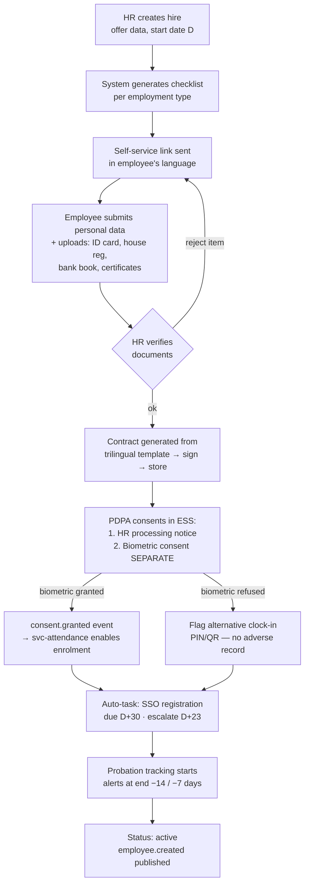
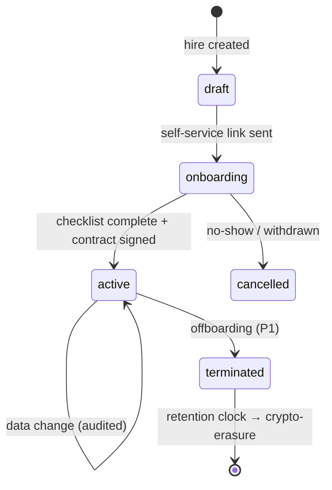
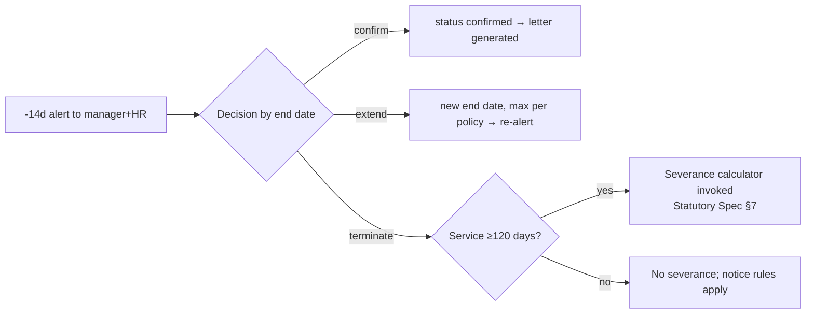
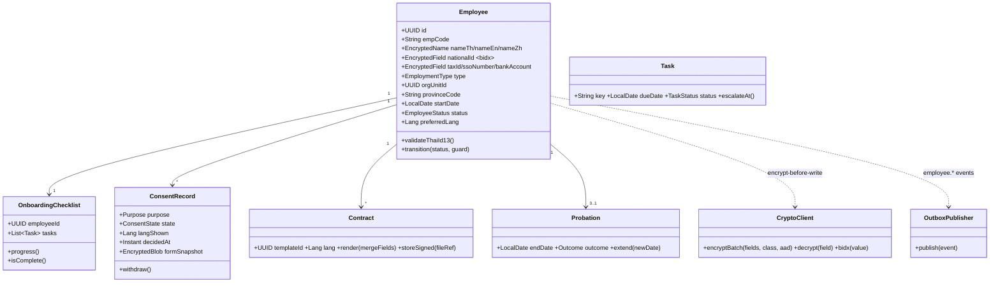

# M1 — HR Onboarding: Module Design (Workflows · Classes · API)

| Field | Value |
|---|---|
| Service | `svc-onboarding` · schema `onboarding` · base path `/api/onboarding` |
| Version | 0.1 (Draft) · Date 2026-08-02 · Stage 3a |
| PRD refs | M1-1…M1-10 · Statutory Spec §5 (SSO 30-day), §10 · PDPA doc §3–4 |

## 1. Workflows

### 1.1 New-hire onboarding (M1-2)

### 1.2 Employee lifecycle states

Guards: `onboarding→active` requires all P0 checklist items done + HR sign-off; `active→terminated` requires termination reason category (feeds M7-7 severance logic) and publishes `employee.terminated` (attendance deletes face template per PDPA doc §7).

### 1.3 Probation decision (M1-5)

## 2. Class Diagram (domain layer)

## 3. API Manual

Auth: OIDC bearer JWT via gateway. All responses `application/json`; errors use `{code, message_i18n_key, details[]}`. Every write is audited; S3-field reads audited individually.

### 3.1 Endpoints

> **Corrected 2026-08-04** (M1/M2/M5/M6 reconciliation, following M1's own build report): rows 2, 7
> and 8 below described a shape the shipped code does not implement. The doc is updated to match the
> code — a search index and a signed pre-auth link are real gaps, not documentation errors, and
> remain open (see the build report's Deviations #1 and #5).

| # | Method & Path | Permission | Description |
|---|---|---|---|
| 1 | `POST /employees` | `employee.create` (HR) | Create hire (draft). Validates Thai ID checksum + bidx uniqueness. Body: profile fields (plaintext over TLS; encrypted before write). 201 → `{id, empCode}` |
| 2 | `GET /employees?org_unit&status` | `employee.read` (scoped) | List via read-model, filtered by org unit/status only. **No name/code search (`q`) or pagination (`page`) — not built; blind indexes only cover national ID/email, and a name-search read model is separate, out-of-scope work per the build report.** |
| 3 | `GET /employees/{id}` | `employee.read` | Profile without S3 fields |
| 4 | `GET /employees/{id}/sensitive?fields=national_id,bank_account&purpose=...` | `employee.sensitive.read` | Decrypts requested S3 fields; `purpose` mandatory → audit entry per field. 403 if role lacks field class |
| 5 | `PATCH /employees/{id}` | `employee.update` | Partial update; S3 changes re-encrypt + re-bidx |
| 6 | `POST /employees/{id}/transition` | `employee.lifecycle` | `{to: active\|terminated\|cancelled, reason}` with guards (§1.2). Termination requires reason category |
| 7 | `GET /employees/{id}/checklist` · `POST /checklist/tasks/{taskId}/complete` | `onboarding.manage` | Checklist read/complete; SSO task cannot be completed without SSO number present. **No separate self-service-token auth path exists for these two routes — both routes require `onboarding.manage` only.** |
| 8 | `POST /self-service/{token}` | `employee.update` | Employee submits own data (JSON body; document upload is a separate, unbuilt gap — see build report Deviation #2). **`{token}` is presently the employee's own id, not a signed one-time link — a real HMAC-signed, expiring, pre-auth token (for a brand-new hire with no Keycloak account yet) is a known, open gap, called out directly in `self-service.service.ts`'s header.** |
| 9 | `POST /employees/{id}/consents` | `consent.self` | `{purpose, decision, formVersion}`; biometric purpose requires separate call, never bundled. Publishes `consent.granted` (never `consent.refused` — a refusal uses the identical success path with a neutral `state` value, see build report) |
| 10 | `DELETE /employees/{id}/consents/biometric` | `consent.self` | One-tap withdrawal (PDPA §4.4) — 202 + SLA info |
| 11 | `POST /employees/{id}/contracts` | `document.generate` | `{templateId, lang, mergeOverrides}` → renders via svc-docs, returns fileRef |
| 12 | `POST /employees/{id}/probation/decision` | `onboarding.manage` | `{outcome: confirm\|extend\|terminate, ...}` per §1.3. **Confirm does not yet generate a confirmation letter — §1.3's flowchart is aspirational for that one step; the outcome itself is recorded correctly (build report Deviation #4).** |
| 13 | `POST /imports/employees` | `employee.import` (P1) | XLSX/CSV bulk with validation report — **not built (P1)**, per PRD M1-7 |

### 3.2 Events

| Direction | Event | Payload (no S3 plaintext) |
|---|---|---|
| out | `employee.created/updated` | id, empCode, orgUnitId, type, startDate, status, lang |
| out | `employee.terminated` | id, terminationDate, reasonCategory |
| out | `consent.granted/withdrawn` | employeeId, purpose, formVersion, at |
| in | — | (M1 is upstream source of truth) |

### 3.3 Error codes (extract)

| Code | Meaning |
|---|---|
| `ONB-001` | Invalid Thai national ID checksum |
| `ONB-002` | Duplicate national ID (blind-index match) |
| `ONB-010` | Lifecycle guard failed (incomplete checklist) |
| `ONB-020` | Biometric consent must be a separate submission |
| `ONB-030` | SSO task overdue — completion blocked without SSO number |
| `CRY-503` | Crypto service unavailable — write refused (fail closed) |

## 4. Test Hooks (feeds Stage 4)
Key ACs to cover: D+30 SSO task creation/escalation; consent-refusal path creates alternative-method flag and no adverse field; DB row inspection shows only ciphertext for 🔐 columns; terminated employee triggers attendance template deletion within SLA.
