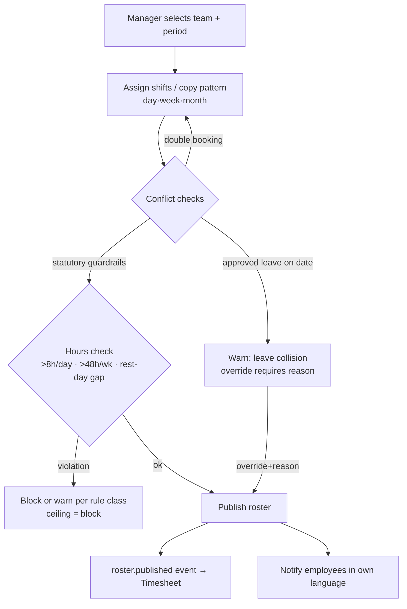
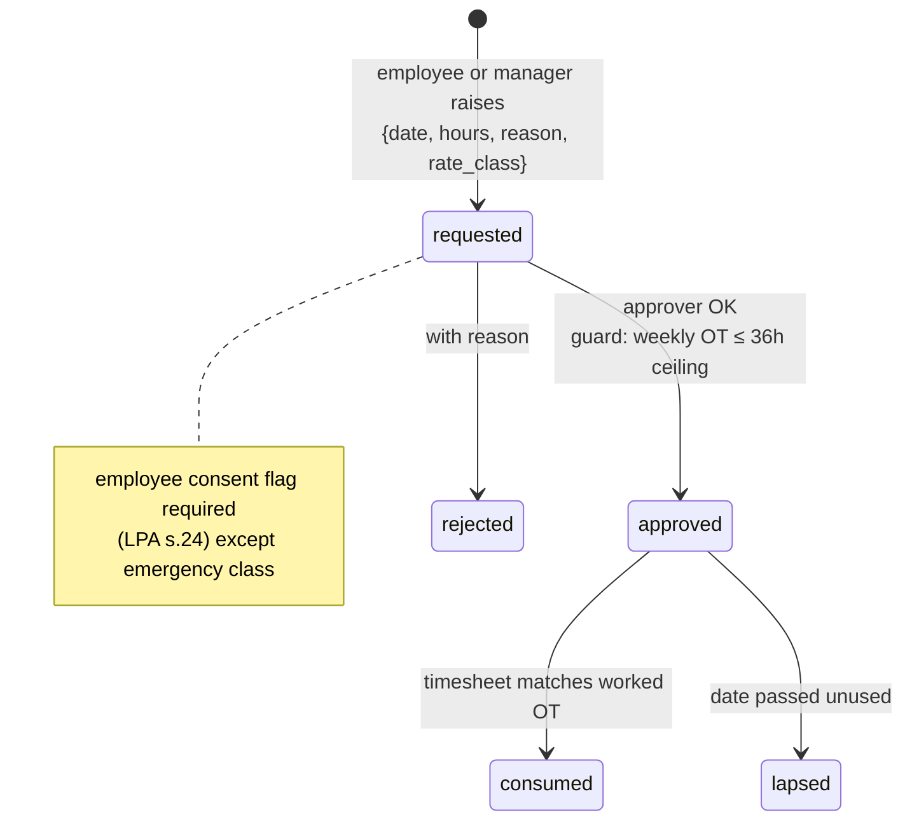
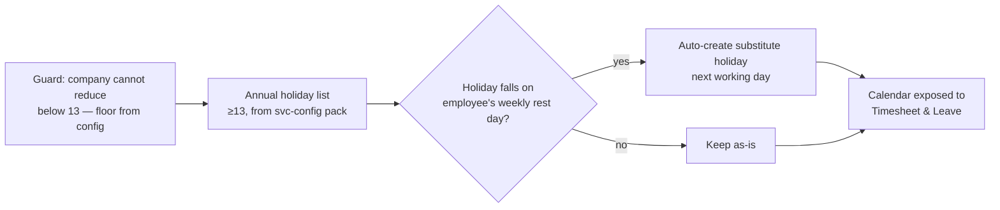
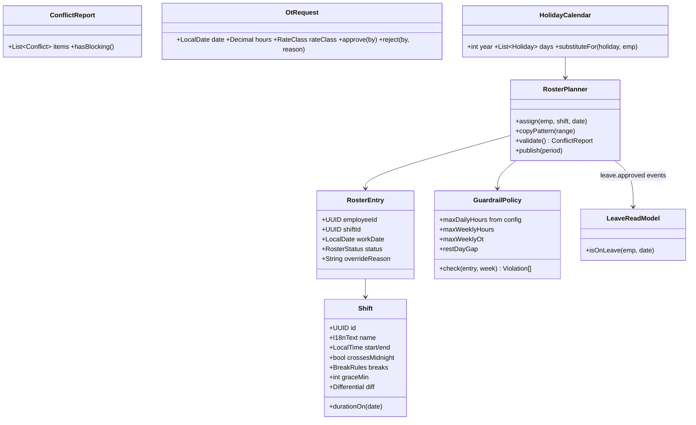

# M2 — Scheduler: Module Design (Workflows · Classes · API)

| Field | Value |
|---|---|
| Service | `svc-scheduler` · schema `scheduler` · base path `/api/scheduler` |
| Version | 0.1 (Draft) · Date 2026-08-02 · Stage 3a |
| PRD refs | M2-1…M2-8 · Statutory Spec §3 (holidays), §4 (hours/OT ceilings) |

## 1. Workflows

### 1.1 Roster planning & publishing (M2-2)

### 1.2 OT pre-approval (M2-5)

### 1.3 Holiday & substitute-day generation (M2-3)

## 2. Class Diagram

`GuardrailPolicy` values are read from `svc-config` (statutory ceilings — never hard-coded) and cache-invalidated on `rules.updated`.

## 3. API Manual

> **Permission names corrected 2026-08-04** (M1/M2/M5/M6 reconciliation, following M2's own build
> report): this table originally specified `schedule.shift.manage` / `schedule.read` /
> `schedule.manage` / `schedule.publish` / `schedule.ot.request` / `schedule.ot.approve` /
> `schedule.holiday.manage`. None of those codes exist in
> `docs/superpowers/plans/00-PROGRAM-ROADMAP.md`'s permission catalog or
> `services/svc-authz/src/seed/roles.ts`'s `PERMISSION_CATALOG` — the roadmap catalog is this
> program's actual fixed contract, reserved for scheduler under different names before this doc was
> written. The M2 build agent correctly followed the roadmap's names instead of this draft; the code
> is right and this table was wrong. Corrected below; the doc is updated, not the code.

| # | Method & Path | Permission | Description |
|---|---|---|---|
| 1 | `POST /shifts` · `PATCH /shifts/{id}` (write) · `GET /shifts` (read) | `roster.write` (write) · `roster.read` (read) | Shift CRUD incl. midnight-crossing and differentials |
| 2 | `GET /rosters?org_unit&from&to` | `roster.read` (scoped) | Team roster grid |
| 3 | `POST /rosters/entries` | `roster.write` (scoped) | Assign `{employeeId, shiftId, date}` → 200 with ConflictReport; 422 `SCH-010` on blocking violation |
| 4 | `POST /rosters/entries/{id}/override` | `roster.write` | Confirm warn-level conflict `{reason}` |
| 5 | `POST /rosters/copy` | `roster.write` | `{sourceRange, targetRange, team}` pattern copy |
| 6 | `POST /rosters/publish` | `roster.publish` | Publishes period → `roster.published`; notifies employees |
| 7 | `POST /ot-requests` | `ot.request` (self, or a manager on a named employee's behalf) | `{date, hours, rateClass, reason, employeeConsent}` |
| 8 | `POST /ot-requests/{id}/decision` | `ot.approve` | approve/reject; approval re-checks 36h ceiling → `SCH-020` |
| 9 | `GET /holidays/{year}` · `POST /holidays/{year}` | read: `roster.read` · manage: `holiday.manage` | Company list ≥13 floor (`SCH-030` if below); substitute preview included |
| 10 | `GET /my/schedule?from&to` | `roster.read` (self-scoped) | Employee's own roster + holidays in own language |
| 11 | `POST /shift-swaps` (P1) | self | Swap request → counterpart accept → manager approve — **not built (P1)**, see PRD M2-6 |

### Events

| Direction | Event | Payload |
|---|---|---|
| out | `roster.published` | period, entries[{employeeId, date, shiftId, times}] |
| out | `ot.approved` | employeeId, date, hours, rateClass |
| in | `employee.created/terminated` | maintain employee ref/read model |
| in | `leave.approved/cancelled` | maintain leave read model for conflicts |

### Error codes (extract)
`SCH-010` blocking statutory-hours violation · `SCH-011` double booking · `SCH-012` leave collision (warn) · `SCH-020` weekly OT ceiling exceeded · `SCH-021` missing employee OT consent · `SCH-030` holiday count below statutory floor.

## 4. Test Hooks
Roster on approved-leave date requires override+reason (PRD M2-2 AC); 49th weekly hour blocked; 13-holiday floor enforced with citation in error; substitute holiday generated when Songkran day falls on rest day; `roster.published` consumed idempotently by Timesheet (duplicate delivery test).
