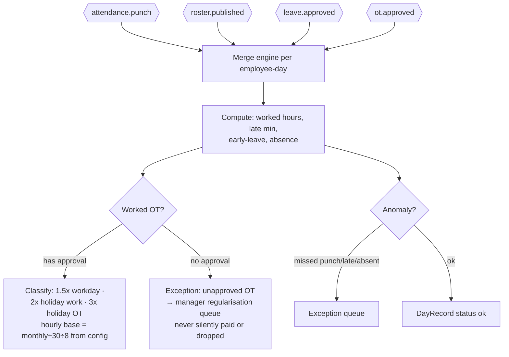
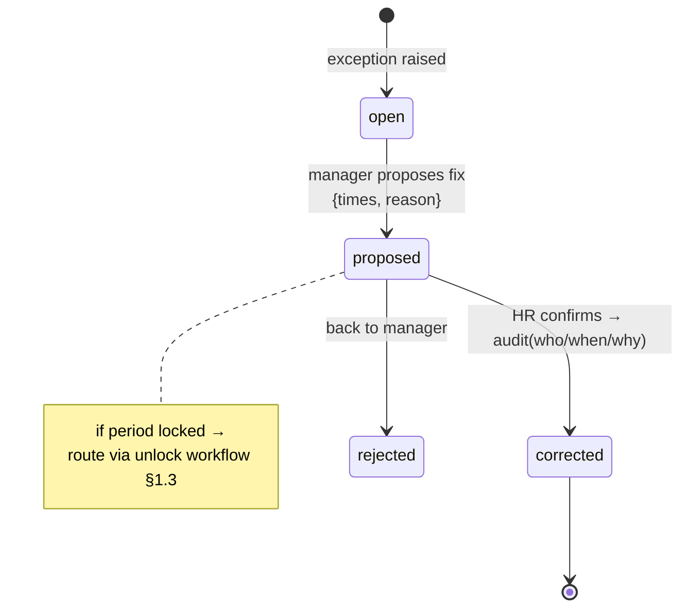
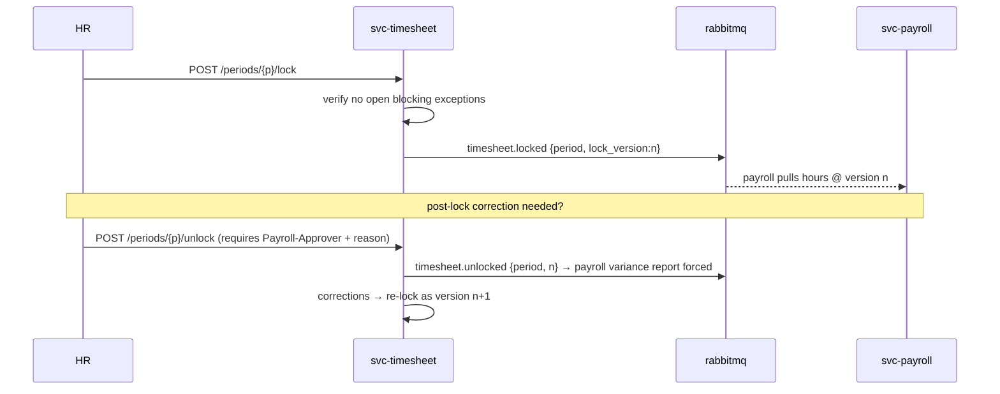
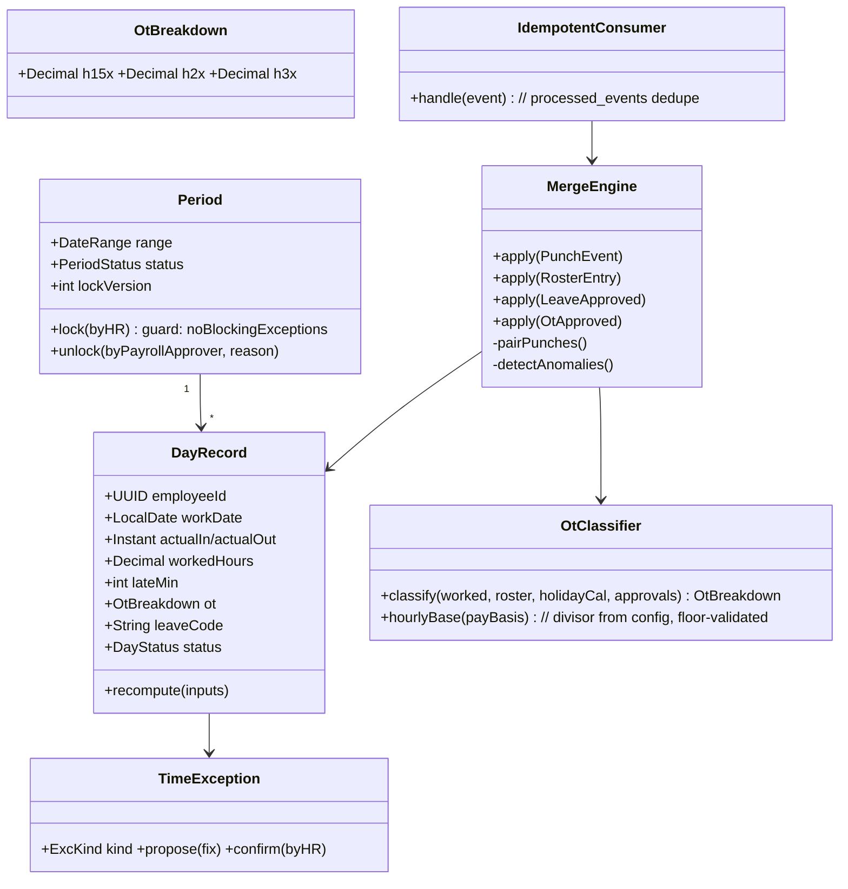

# M3 — Timesheet: Module Design (Workflows · Classes · API)

| Field | Value |
|---|---|
| Service | `svc-timesheet` · schema `timesheet` · base path `/api/timesheet` |
| Version | 0.1 (Draft) · Date 2026-08-02 · Stage 3a |
| PRD refs | M3-1…M3-8 · Statutory Spec §4 (OT classes & formula) |

## 1. Workflows

### 1.1 Daily consolidation (M3-1/M3-2) — event-driven

### 1.2 Exception correction (M3-3)

### 1.3 Period lock & payroll handshake (M3-4)

## 2. Class Diagram

## 3. API Manual

| # | Method & Path | Permission | Description |
|---|---|---|---|
| 1 | `GET /my/days?from&to` | self | Own timesheet incl. OT breakdown, in own language |
| 2 | `GET /teams/{orgUnit}/days?from&to` | `timesheet.read` (scoped) | Manager team view with exception badges |
| 3 | `GET /days/{employeeId}?from&to` | `timesheet.read.org` | HR org-wide view |
| 4 | `GET /exceptions?status&org_unit` | `timesheet.exception.manage` (scoped) | Queue: missed punch / late / absence / unapproved OT |
| 5 | `POST /exceptions/{id}/propose` | manager (scoped) | `{actualIn?, actualOut?, resolution, reason}` |
| 6 | `POST /exceptions/{id}/confirm` | `timesheet.correct` (HR) | Applies fix, recomputes day, audits who/when/why |
| 7 | `POST /manual-punch` | `timesheet.correct` | HR manual punch (method=`manual`) — same event pipeline |
| 8 | `GET /periods` · `POST /periods/{id}/lock` | `timesheet.lock` | Lock guard: open blocking exceptions → 409 `TSH-030` |
| 9 | `POST /periods/{id}/unlock` | `payroll.run.approve` role | Requires reason; publishes `timesheet.unlocked`; step-up re-auth |
| 10 | `GET /periods/{id}/export?format=csv` | `timesheet.export` | Locked-version snapshot for audit |
| 11 | `GET /ot/summary?period&org_unit` | `timesheet.read` | OT hours by rate class vs 36h ceiling utilisation |

### Events

| Direction | Event | Payload |
|---|---|---|
| in | `attendance.punch` | employeeId, ts, direction, method, site (idempotent) |
| in | `roster.published`, `leave.approved/cancelled`, `ot.approved`, `employee.*` | read models |
| out | `timesheet.locked` / `timesheet.unlocked` | period, lockVersion |
| out | `timesheet.corrected` | dayRecordId, delta, actor (→ audit) |

### Error codes (extract)
`TSH-010` correction on locked period (use unlock flow) · `TSH-020` unapproved-OT exception unresolved at lock · `TSH-030` lock blocked by open exceptions · `TSH-040` OT formula config would underpay statutory floor (rejected at config layer, surfaced here).

## 4. Test Hooks
Duplicate `attendance.punch` delivery produces one DayRecord change; midnight-crossing shift pairs punches to correct date; holiday work by monthly vs daily-rate employee classifies 2x correctly; unapproved OT flagged not paid; lock→unlock→re-lock produces version n+1 and payroll variance flag; 10 punch/sec burst (PRD §7.5) without loss.
