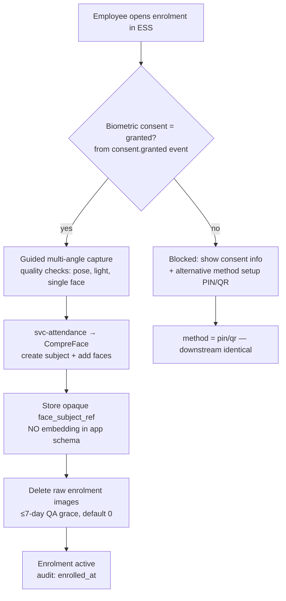
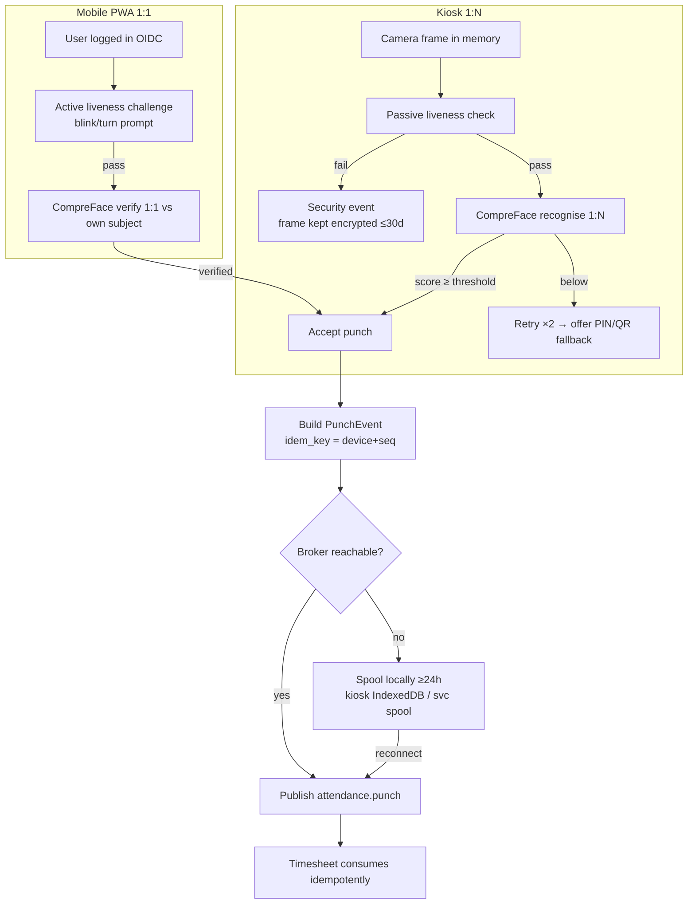
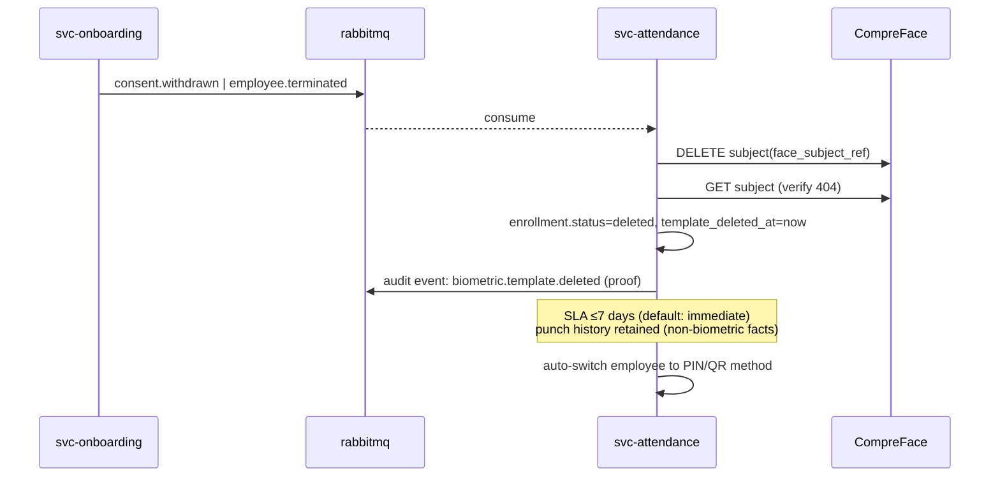
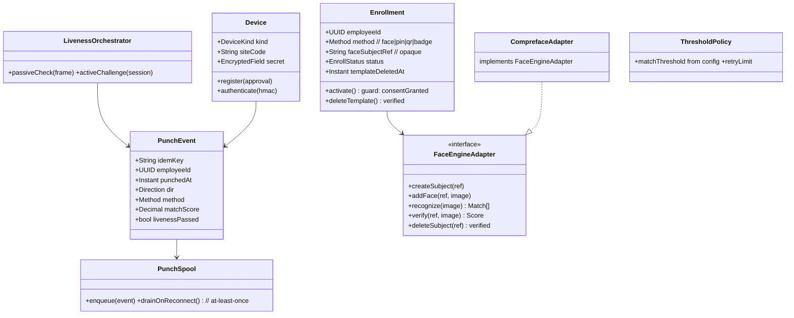

# M4 — Facial Recognition Attendance: Module Design (Workflows · Classes · API)

| Field | Value |
|---|---|
| Service | `svc-attendance` (+ `compreface-*` engine) · schema `attendance` · base path `/api/attendance` |
| Version | 0.1 (Draft) · Date 2026-08-02 · Stage 3a |
| PRD refs | M4-1…M4-10 · PDPA doc §4–5 (consent, raw-image rules) · ADR-007 |

## 1. Workflows

### 1.1 Enrolment (M4-1) — consent-gated

### 1.2 Clock-in/out (M4-2/M4-3)

### 1.3 Consent withdrawal / termination — template deletion (PDPA §4.4)

## 2. Class Diagram

`FaceEngineAdapter` is the swap point if CompreFace fails the ADR-007 benchmark (fallback: custom InsightFace service).

## 3. API Manual

Kiosk endpoints authenticate with per-device HMAC secret; human endpoints via OIDC.

| # | Method & Path | Permission | Description |
|---|---|---|---|
| 1 | `POST /enrolments/start` | self (ESS) | Guard: biometric consent granted → 409 `ATT-001` otherwise. Returns capture session |
| 2 | `POST /enrolments/{session}/frames` | self | Multipart frame(s); quality feedback; frames never persisted post-session |
| 3 | `POST /enrolments/{session}/complete` | self | Creates subject, stores ref, schedules raw deletion |
| 4 | `POST /enrolments/alternative` | self / `attendance.manage` | Set PIN or issue QR/badge (hashed storage) |
| 5 | `POST /punches/face` | device (kiosk) | Frame → liveness → 1:N recognise → punch. 200 `{employee, direction, ts}` / 422 `ATT-020` liveness / 404 `ATT-021` no match |
| 6 | `POST /punches/verify` | self (PWA) | Active-liveness session token + frame → 1:1 verify → punch |
| 7 | `POST /punches/code` | device/self | PIN/QR/badge punch — same PunchEvent shape (method-agnostic downstream) |
| 8 | `POST /punches/batch` | device | Spooled offline punches `[ {idemKey,...} ]` — idempotent replay safe |
| 9 | `GET /my/punches?from&to` | self | Own punch history (no scores shown) |
| 10 | `GET /devices` · `POST /devices` · `POST /devices/{id}/approve` | `attendance.device.manage` | Device registration with second-person approval |
| 11 | `GET /security-events?kind=liveness_failed` | `attendance.security.read` | Weekly review queue (PRD metric) |
| 12 | `DELETE /enrolments/{employeeId}/template` | system (events) / DPO | Verified engine deletion → audit proof |

### Events

| Direction | Event | Payload |
|---|---|---|
| out | `attendance.punch` | employeeId, ts, direction, method, site, deviceId, matchScore?, idemKey |
| out | `attendance.liveness_failed` | deviceId, ts, site (no image in event) |
| out | `biometric.template.deleted` | employeeId, verifiedAt (audit proof) |
| in | `consent.granted/withdrawn`, `employee.terminated` | gate enrolment / trigger deletion |

### Error codes (extract)
`ATT-001` enrolment without biometric consent · `ATT-010` capture quality insufficient · `ATT-020` liveness failed · `ATT-021` no match ≥ threshold · `ATT-022` multiple faces (kiosk anti-tailgating) · `ATT-030` device not approved / bad HMAC · `ATT-040` duplicate idemKey (already processed → 200 replay-safe).

## 4. Non-Functional Targets
Match p50 ≤ 2 s end-to-end (CPU); FAR ≤ 0.1% at configured threshold (benchmark gate, ADR-007); kiosk offline ≥ 24 h; punch burst 10/s; zero raw-image persistence on success path (verified by test).

## 5. Test Hooks
Photo/video replay rejected by liveness suite; consent-withdrawal deletes subject with 404 verification + audit proof while punch history remains; offline spool replay produces no duplicates in Timesheet; PIN fallback event shape identical to face; device with revoked secret rejected; two faces in kiosk frame → `ATT-022`, no punch.
