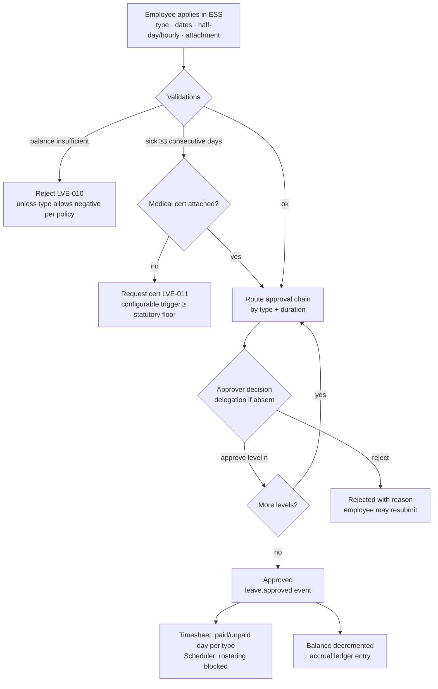
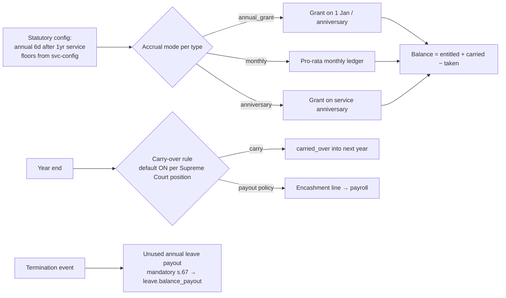
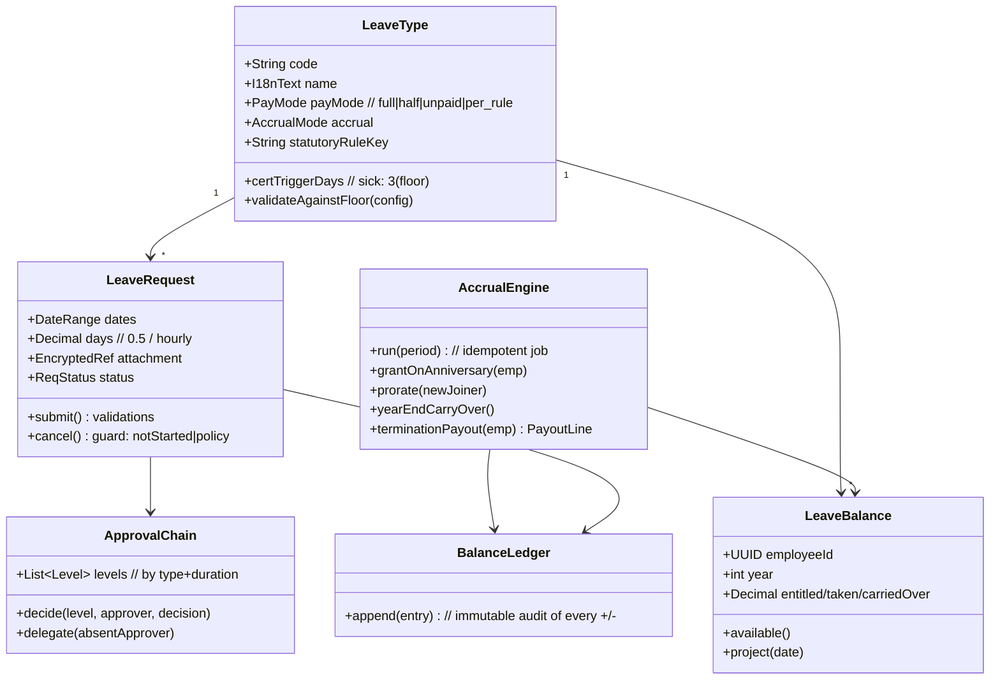

# M5 — Leave: Module Design (Workflows · Classes · API)

| Field | Value |
|---|---|
| Service | `svc-leave` · schema `leave` · base path `/api/leave` |
| Version | 0.1 (Draft) · Date 2026-08-02 · Stage 3b |
| PRD refs | M5-1…M5-8 · Statutory Spec §3 (entitlements incl. LPA No. 9 types) |

## 1. Workflows

### 1.1 Leave request & approval (M5-3)

### 1.2 Accrual & carry-over (M5-2)

### 1.3 Statutory-type lifecycle (new LPA No. 9 types)

Maternity (120d), paternity (15d @100%), infant-care (15d @50%) ship as `statutory_rule_key`-linked types: entitlement, pay mode, and effective dates resolve from `svc-config` — an HR attempt to lower any below floor is rejected with the citation (`LVE-030`). Pay-mode `per_rule` lets payroll apply the 50% infant-care rate and the maternity employer/SSO split (Statutory Spec V1 verification item).

## 2. Class Diagram

## 3. API Manual

> **Corrected 2026-08-04** (M1/M2/M5/M6 reconciliation, following M5's own build report):
> `leave.type.manage`, `leave.manage`, `leave.balance.adjust` do not exist in the roadmap's
> permission catalog or `services/svc-authz/src/seed/roles.ts`; the catalog reserves
> `leave.request` / `leave.approve` / `leave.admin` / `leave.balance.read` for this module, and the
> build used those (row 1 read uses `leave.request` — the same permission a requester needs — since
> no separate "browse types" code exists in the catalog). Row 7's team calendar was not built (PRD
> M5-6 is explicitly P1); marked below.

| # | Method & Path | Permission | Description |
|---|---|---|---|
| 1 | `GET /types` (read) · `POST /types` · `PATCH /types/{id}` (manage) | read: `leave.request` · manage: `leave.admin` | Type CRUD; statutory floor check → 422 `LVE-030` with citation |
| 2 | `GET /my/balances?year` | `leave.balance.read` (self) | Balances + projection `?asOf=date` in own language |
| 3 | `POST /requests` | `leave.request` (self) | Apply `{typeCode, dates, days, attachment?}`; sick-cert rule enforced |
| 4 | `POST /requests/{id}/cancel` | `leave.request` (self) | Guarded cancel; publishes `leave.cancelled` |
| 5 | `GET /approvals` | `leave.approve` (scoped) | Queue, including delegated approvals |
| 6 | `POST /approvals/{id}/decision` | `leave.approve` (scoped) | `{decision, comment}`; final level publishes `leave.approved` |
| 7 | `GET /teams/{orgUnit}/calendar?month` | `leave.approve` (scoped) | Team absence calendar — **not built (P1)**, per PRD M5-6 |
| 8 | `POST /balances/{employeeId}/adjust` | `leave.admin` | Manual adjustment `{delta, reason}` → ledger + audit |
| 9 | `GET /balances/{employeeId}/ledger` | `leave.balance.read` | Immutable accrual history |
| 10 | `POST /encashment` (P1) | self | Request payout where policy allows → payroll line — **not built (P1)**, per PRD M5-7 |

### Events

| Direction | Event | Payload |
|---|---|---|
| out | `leave.approved` / `leave.cancelled` | employeeId, typeCode, dates, days, payMode |
| out | `leave.balance_payout` | employeeId, days, type=annual, trigger=termination\|encashment |
| in | `employee.created/terminated` | seed balances / trigger payout calc |
| in | `rules.updated` | re-validate types vs new floors, re-cache |

### Error codes (extract)
`LVE-010` insufficient balance · `LVE-011` medical certificate required (≥3 consecutive sick days) · `LVE-020` dates overlap existing request · `LVE-030` entitlement below statutory floor (citation attached) · `LVE-040` cancel window passed.

## 4. Test Hooks
6-day annual floor cannot be reduced (citation shown); maternity request spanning effective-date boundary (pre/post 7 Dec 2025 rule versions) resolves per date; infant-care day lands in Timesheet as 50%-pay code; termination triggers `leave.balance_payout` consumed by payroll final-pay; delegation approves when level-1 approver on leave themselves; ledger sums always equal balance.
