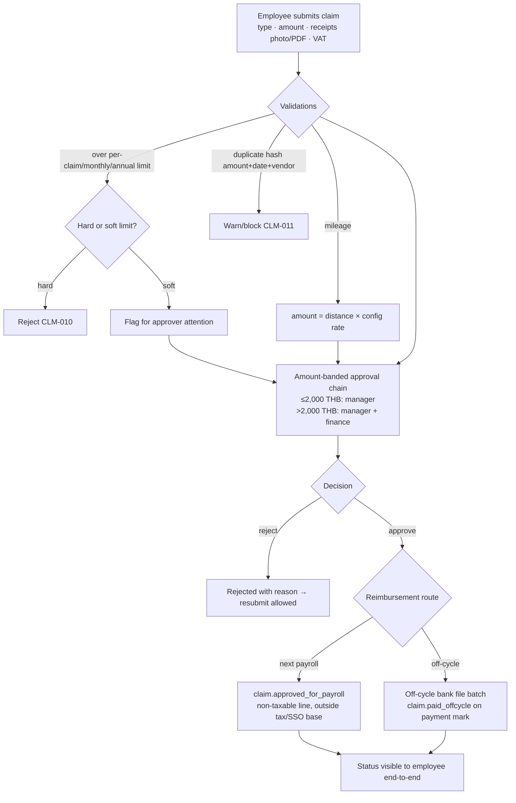
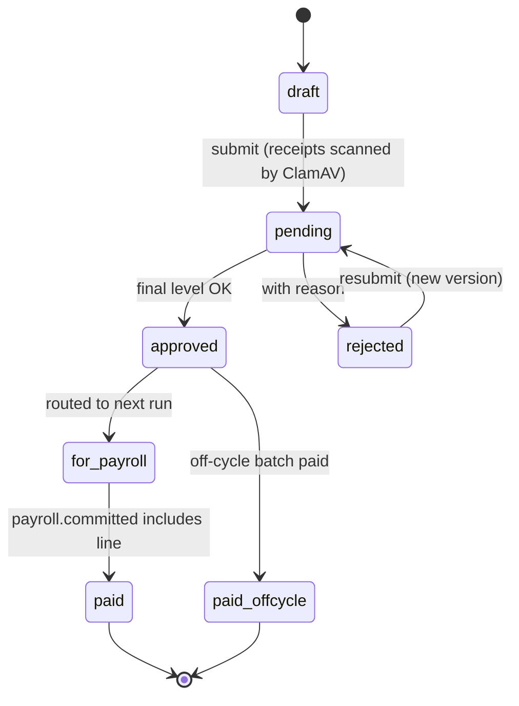
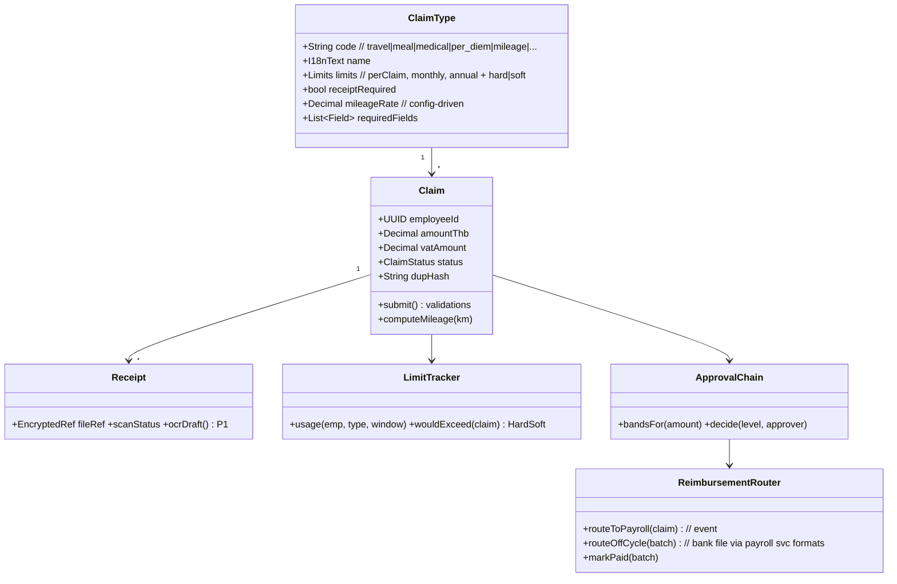

# M6 — Claims: Module Design (Workflows · Classes · API)

| Field | Value |
|---|---|
| Service | `svc-claims` · schema `claims` · base path `/api/claims` |
| Version | 0.1 (Draft) · Date 2026-08-02 · Stage 3b |
| PRD refs | M6-1…M6-8 · Statutory Spec §10 (s.76 deduction whitelist interaction) |

## 1. Workflows

### 1.1 Claim submission → reimbursement (M6-2/M6-3/M6-4)

### 1.2 Claim states

## 2. Class Diagram

## 3. API Manual

| # | Method & Path | Permission | Description |
|---|---|---|---|
| 1 | `GET /types` · `POST /types` · `PATCH /types/{id}` | read: all · manage: `claims.type.manage` | Type/limit/field config |
| 2 | `POST /claims` | self | Submit (multipart receipts; AV-scanned; dup-hash checked) |
| 3 | `GET /my/claims?status` | self | Own claims with end-to-end status + usage vs limits |
| 4 | `POST /claims/{id}/resubmit` | self | New version after rejection |
| 5 | `GET /approvals?band&status` | approver (scoped) | Queue; soft-limit flags surfaced |
| 6 | `POST /approvals/{id}/decision` | approver band permission (`claims.approve.l1/l2`) | approve/reject with comment |
| 7 | `POST /claims/{id}/route` | `claims.disburse` (finance) | `{route: payroll\|offcycle}` |
| 8 | `POST /offcycle-batches` · `POST /offcycle-batches/{id}/mark-paid` | `claims.disburse` | Batch build (bank file via payroll formats) and payment confirmation |
| 9 | `GET /reports/usage?type&period&org_unit` | `claims.report` | Spend vs budget by type/unit |

### Events

| Direction | Event | Payload |
|---|---|---|
| out | `claim.approved_for_payroll` | claimId, employeeId, amount, typeCode (non-taxable flag) |
| out | `claim.paid_offcycle` | claimId, batchId, paidAt |
| in | `payroll.committed` | mark `for_payroll` lines as paid |
| in | `employee.*` | refs/read model |

### Error codes (extract)
`CLM-010` hard limit exceeded · `CLM-011` duplicate receipt suspected · `CLM-012` receipt required/failed AV scan · `CLM-020` approver outside amount band · `CLM-030` route change after payroll pull (locked).

## 4. Test Hooks
2,000 THB band boundary routes to correct chain; duplicate receipt (same amount+date+vendor) blocked; reimbursement line appears in payslip as non-taxable and excluded from SSO/tax wage base (cross-check with M7 tests); off-cycle batch total equals sum of claims; `payroll.committed` flips statuses exactly once (idempotent).
