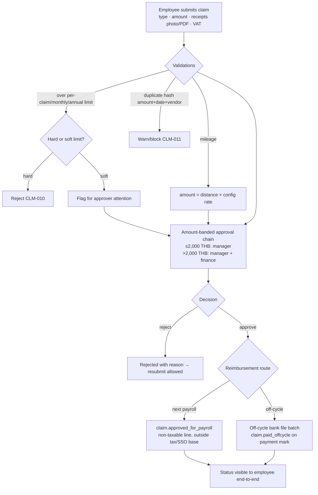
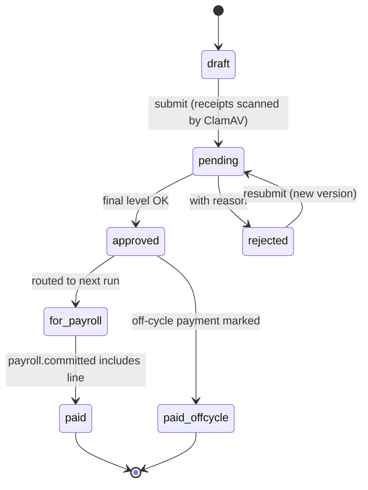
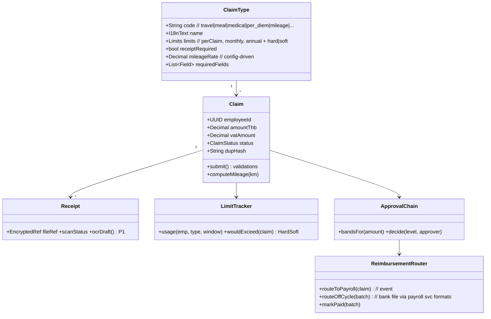

# M6 — Claims: Module Design (Workflows · Classes · API)

| Field | Value |
|---|---|
| Service | `svc-claims` · schema `claims` · base path `/api/claims` |
| Version | 0.1 (Draft) · Date 2026-08-02 · Stage 3b |
| PRD refs | M6-1…M6-8 · Statutory Spec §10 (s.76 deduction whitelist interaction) |

## 1. Workflows

### 1.1 Claim submission → reimbursement (M6-2/M6-3/M6-4)

### 1.2 Claim states

> **2026-08-04 correction:** the shipped `claims.claim.status` CHECK constraint has exactly six
> values and does not include `paid` — `for_payroll → paid` (consuming `payroll.committed`) is not
> implemented; a claim reaching `for_payroll` stays there until a follow-up migration adds the
> seventh state alongside M7. The diagram is aspirational for that one transition; everything else
> in it matches the shipped code.

## 2. Class Diagram

## 3. API Manual

> **Corrected 2026-08-04** (M1/M2/M5/M6 reconciliation, following M6's own build report). Three
> kinds of drift, all resolved in favour of the shipped code — a spec written before any code
> existed, corrected against what actually built and passed its acceptance tests:
> 1. **Permission names.** `claims.type.manage` / `claims.approve.l1`/`l2` / `claims.disburse` /
>    `claims.report` do not exist in the roadmap's permission catalog or
>    `services/svc-authz/src/seed/roles.ts`. The catalog reserves `claim.submit` / `claim.approve` /
>    `claim.approve.finance` / `claim.admin` for this module; the build used those.
> 1. `GET /types/{id}` was drafted as `{id}`; the shipped route keys on the type's `code` —
>    `GET/PATCH /types/{code}`.
> 1. **No generic `/approvals` queue or `/offcycle-batches` two-step batch flow was built.**
>    Approval is two explicit routes, one per band level (`POST /claims/{id}/decisions/manager`,
>    `POST /claims/{id}/decisions/finance}`), and off-cycle payment is a single-claim status change
>    (`POST /claims/{id}/route {route: offcycle}`) rather than a batch aggregate — PRD M6-4's P0
>    acceptance criteria only require the event and end-to-end status visibility, not a batch
>    entity. `GET /reports/usage` (row 9) was not built at all; **P1**, not part of this module's P0
>    scope per PRD M6-3..M6-5.

| # | Method & Path | Permission | Description |
|---|---|---|---|
| 1 | `GET /types` · `GET /types/{code}` (read) · `POST /types` · `PATCH /types/{code}` (manage) | read: `claim.submit` · manage: `claim.admin` | Type/limit/field config |
| 2 | `POST /claims` | `claim.submit` (self) | Submit (receipt file references, already uploaded; dup-hash checked) |
| 3 | `GET /my/claims?status` | `claim.submit` (self) | Own claims with end-to-end status + usage vs limits |
| 4 | `POST /claims/{id}/resubmit` | `claim.submit` (self) | New version after rejection; increments `round`, re-bands |
| 5 | `GET /approval-bands` · `PUT /approval-bands` | `claim.admin` | Band config (max amount, ordered approver roles) — **replaces the drafted `GET /approvals` queue, which was not built** |
| 6 | `POST /claims/{id}/decisions/manager` | `claim.approve` | First-band (manager-level) approve/reject with reason |
| 6b | `POST /claims/{id}/decisions/finance` | `claim.approve.finance` | Second-band (>2,000 THB) approve/reject with reason — **replaces the drafted single `claims.approve.l1/l2`-gated `/approvals/{id}/decision`** |
| 7 | `POST /claims/{id}/route` | `claim.approve.finance` | `{route: payroll\|offcycle}` — single-claim status change; **no batch entity** (see note above) |
| 8 | ~~`POST /offcycle-batches` · `POST /offcycle-batches/{id}/mark-paid`~~ | — | **Not built** — see note above |
| 9 | ~~`GET /reports/usage?type&period&org_unit`~~ | — | **Not built — P1**, see note above |

### Events

| Direction | Event | Payload |
|---|---|---|
| out | `claim.approved_for_payroll` | claimId, employeeId, amountThb, claimType, `taxable: false`, `ssoWageBase: false` |
| out | `claim.paid_offcycle` | claimId, employeeId, amountThb, claimType, `taxable: false`, paidAt |
| in | ~~`payroll.committed`~~ | **Not consumed yet** — the base migration's `status` CHECK has no `paid` state to transition into; deferred to land alongside M7 (see M6 build report, deviation 3) |
| in | `employee.created/updated/terminated` | refs/read model (`claims_employee_ref`), consumed idempotently |

### Error codes (extract)
`CLM-010` hard limit exceeded · `CLM-011` duplicate receipt suspected · `CLM-012` receipt required/failed AV scan · `CLM-020` approver outside amount band · `CLM-030` route change after payroll pull (locked).

## 4. Test Hooks
2,000 THB band boundary routes to correct chain; duplicate receipt (same amount+date+vendor) blocked; reimbursement line appears in payslip as non-taxable and excluded from SSO/tax wage base (cross-check with M7 tests); off-cycle batch total equals sum of claims; `payroll.committed` flips statuses exactly once (idempotent).
