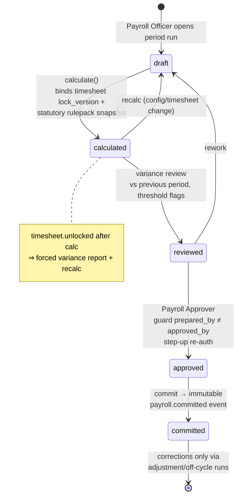
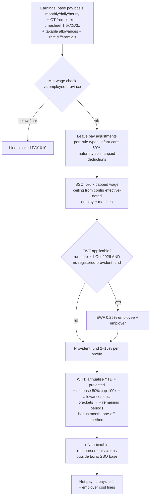
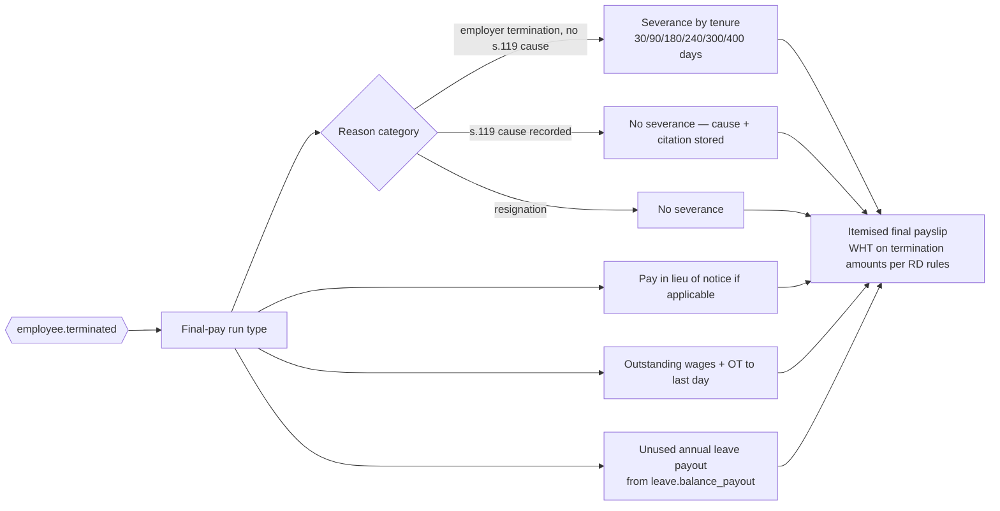
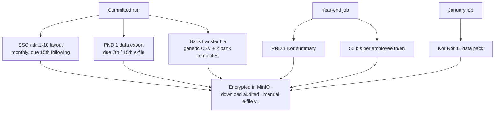
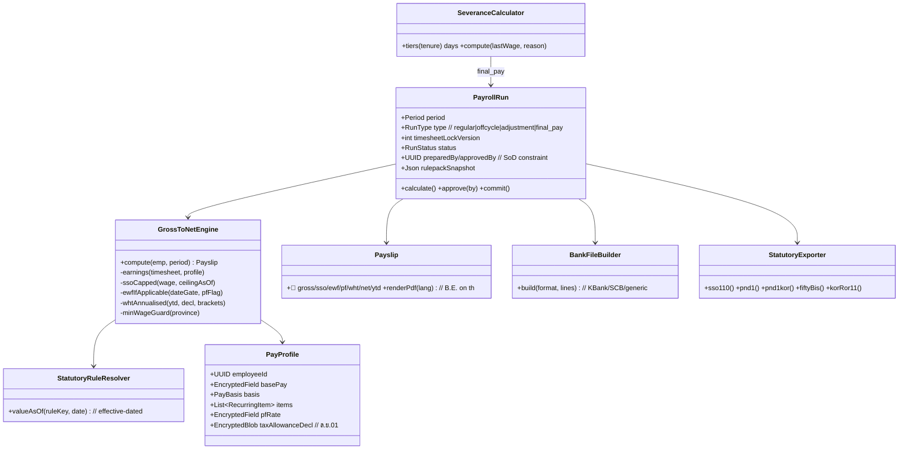

# M7 — Payroll: Module Design (Workflows · Classes · API)

| Field | Value |
|---|---|
| Service | `svc-payroll` · schema `payroll` · base path `/api/payroll` |
| Version | 0.1 (Draft) · Date 2026-08-02 · Stage 3b |
| PRD refs | M7-1…M7-12 · Statutory Spec §4–§9 (OT, SSO, EWF, PIT, min wage), §7 (severance) |

## 1. Workflows

### 1.1 Regular run lifecycle (M7-3) — segregation of duties

### 1.2 Gross-to-net sequence (M7-2) — statutory order

Every rate/ceiling/bracket resolves from `svc-config` **as of the period date** — the September vs October 2026 EWF test in PRD M7-2 AC is the canonical proof.

### 1.3 Termination / final pay (M7-7)

### 1.4 Statutory export generation (M7-6)

## 2. Class Diagram

## 3. API Manual

All payroll endpoints require step-up re-auth for approve/commit/export download. Amount fields encrypted at rest; API returns plaintext only to authorised roles and audits reads.

| # | Method & Path | Permission | Description |
|---|---|---|---|
| 1 | `GET/POST/PATCH /profiles/{employeeId}` | `payroll.profile.manage` | Pay basis, recurring items, PF rate, tax declaration |
| 2 | `POST /runs` | `payroll.run.prepare` | `{period, type}` → draft; binds current timesheet lock |
| 3 | `POST /runs/{id}/calculate` | `payroll.run.prepare` | Executes gross-to-net for all in-scope employees; snapshot of rulepack versions stored |
| 4 | `GET /runs/{id}/variance?threshold` | prepare/approve | Line-level diff vs previous period; unlock-forced flags |
| 5 | `POST /runs/{id}/approve` | `payroll.run.approve` | Guard `prepared_by ≠ approved_by` → 403 `PAY-020`; step-up |
| 6 | `POST /runs/{id}/commit` | `payroll.run.approve` | Immutable; publishes `payroll.committed`; triggers payslip render |
| 7 | `GET /runs/{id}/payslips` · `GET /my/payslips` | officer (scoped) / self | List + PDF refs; self access audited-light |
| 8 | `POST /runs/{id}/bank-file?format=kbank\|scb\|generic` | `payroll.disburse` | Net-pay file; download audited |
| 9 | `POST /runs/{id}/exports/{kind}` | `payroll.statutory.export` | kind ∈ sso_1_10 · pnd1 · pnd1kor · fifty_bis · kor_ror_11 |
| 10 | `POST /final-pay/{employeeId}` | `payroll.run.prepare` | Final-pay run: wages, leave payout, severance (reason-driven), notice in lieu — itemised |
| 11 | `POST /adjustment-runs` | `payroll.run.prepare` | Corrections referencing a committed run (never mutate it) |
| 12 | `GET /reports/employer-cost?period` | `payroll.report` | SSO/EWF/PF employer lines, cost by org unit |

### Events

| Direction | Event | Payload |
|---|---|---|
| in | `timesheet.locked/unlocked` | bind/flag lock versions |
| in | `leave.balance_payout`, `claim.approved_for_payroll`, `employee.terminated` | run inputs |
| out | `payroll.committed` | runId, period, employeeIds (no amounts) |
| out | `payslip.issued` | employeeId, period → notify svc |

### Error codes (extract)
`PAY-010` pay below provincial minimum wage (province + floor cited) · `PAY-012` NO minimum-wage notification on file for the employee's province — fails closed, blocks the run rather than emitting a payslip note (see the roadmap's unverified-statutory-figures section, §12 V4) · `PAY-020` SoD violation preparer=approver · `PAY-021` commit without approval · `PAY-030` timesheet lock version stale (unlock occurred) — recalc required · `PAY-040` missing tax declaration → default single-allowance basis applied with warning · `PAY-050` export before commit.

## 4. Test Hooks (feeds Stage 4 + parallel-run plan)
Canonical fixtures: (a) Sep-2026 vs Oct-2026 EWF gate; (b) SSO ceiling boundary salary at old/new ceiling effective dates; (c) OT-heavy daily-rate employee incl. 3× holiday OT; (d) infant-care 50% mid-month; (e) bonus-month WHT; (f) termination at 3 years −1 day vs +1 day (90 vs 180 severance days); (g) claims reimbursement excluded from SSO/tax base; (h) preparer attempting self-approval rejected; (i) committed-run mutation attempt blocked at DB; (j) two full parallel runs vs incumbent ≤0.5% variance (PRD success metric).
